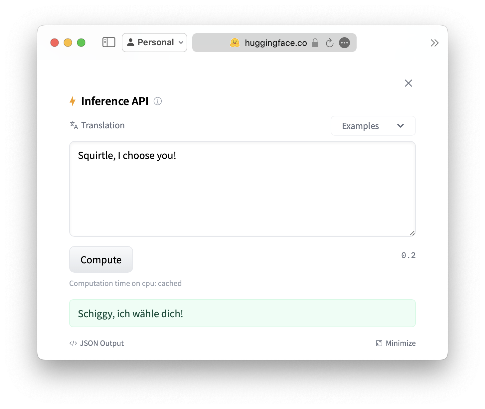

# Pokemon LLM Finetuner

This project is intended to act as a tutorial for fine-tuning LLMs. It intends to provide a method to fine-tune the [Helsinki NLP English to German LLM](https://huggingface.co/Helsinki-NLP/opus-mt-en-de) so that it can properly translate Pokemon names.

## Background

At the moment, inputting a phrase like "Squirtle, I choose you!" into the base LLM will lead to the incorect translation "Squirtle, ich wähle dich!". The goal is to fine-tune the LLM so that it can properly translate the phrase to "Schiggy, ich wähle dich!".

This project is based on the [Hugging Face Transformers](https://huggingface.co/transformers/) library and the [Hugging Face Datasets](https://huggingface.co/docs/datasets/) library. These are powerful tools that make it easy to fine-tune and use LLMs.

This project makes use of the [Helsinki NLP English to German LLM](https://huggingface.co/Helsinki-NLP/opus-mt-en-de), but is adatptable to other LLMs.

## Installation

This entire project can run on the free tier of Google Colab. Open the provided notebook in Colab and run the first cell to install the necessary libraries.

Next, input your [Hugging Face API token](https://huggingface.co/docs/hub/en/security-tokens) in the second cell.

## Credits

This projects was created by AJ Grant

The Pokemon data used in this project comes from this [forum post](https://www.pokecommunity.com/threads/international-list-of-names-in-csv.460446/)
